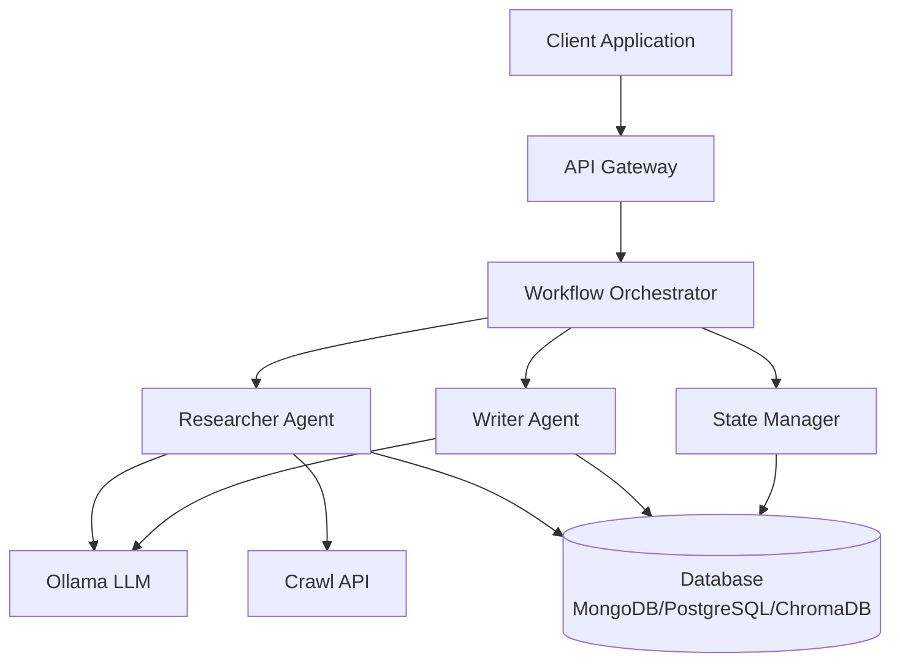
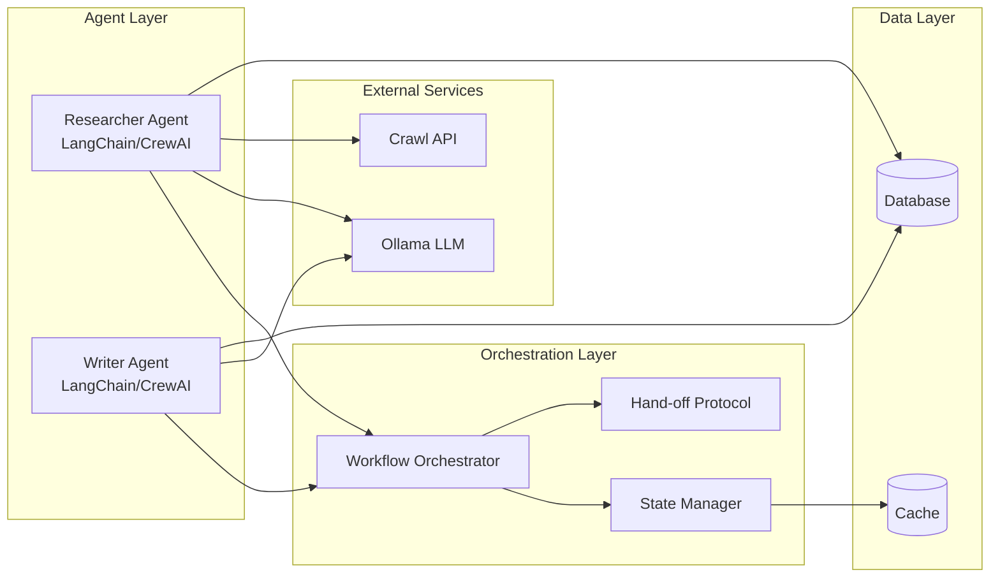
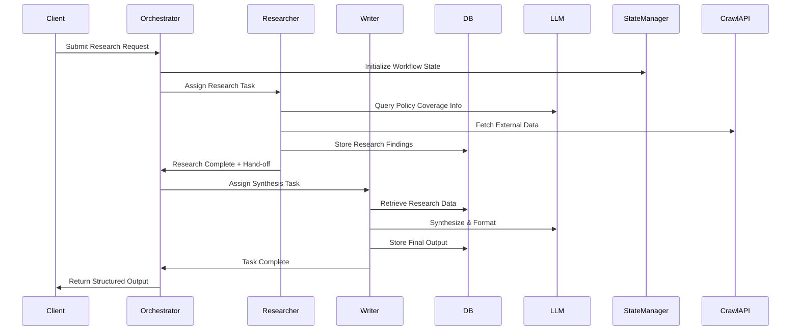
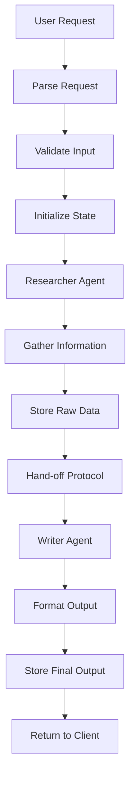

# Multi-Agent Insurance System - Architecture Design

## 1. System Overview

The Multi-Agent Insurance System is a collaborative agent-based architecture that leverages specialized AI agents to research and synthesize insurance policy information. The system employs a hand-off protocol between agents to ensure efficient workflow orchestration.

## 2. High-Level Architecture

## 3. Component Architecture

## 4. Agent Communication Flow

## 5. Data Flow Architecture

## 6. Technology Stack

| Layer | Technology |
|-------|-----------|
| Framework | CrewAI, LangChain |
| LLM | Ollama |
| Database | MongoDB / PostgreSQL / ChromaDB |
| External API | Crawl API |
| Language | Python |
| State Management | Custom State Manager |

## 7. Key Design Principles

1. **Agent Specialization**: Each agent has a distinct role and responsibility
2. **Loose Coupling**: Agents communicate through orchestration layer
3. **State Persistence**: Workflow state is maintained across agent hand-offs
4. **Scalability**: Architecture supports horizontal scaling of agents
5. **Fault Tolerance**: Error handling and retry mechanisms at each layer

