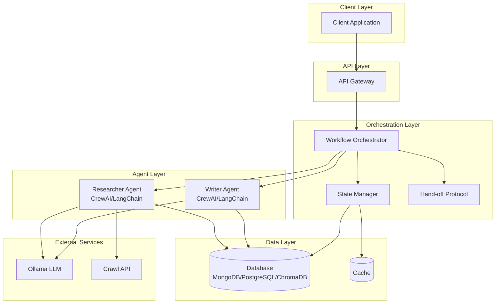
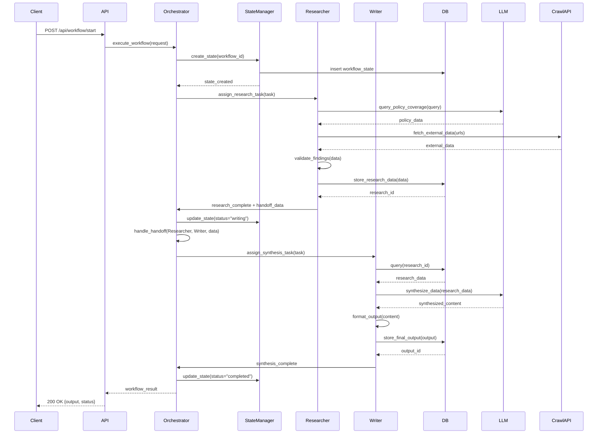
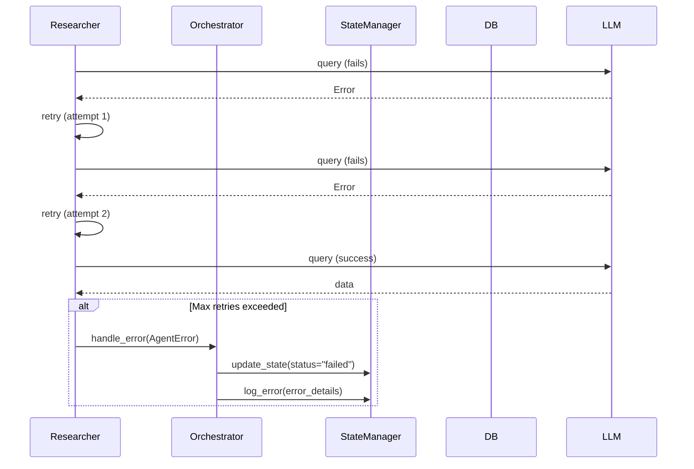
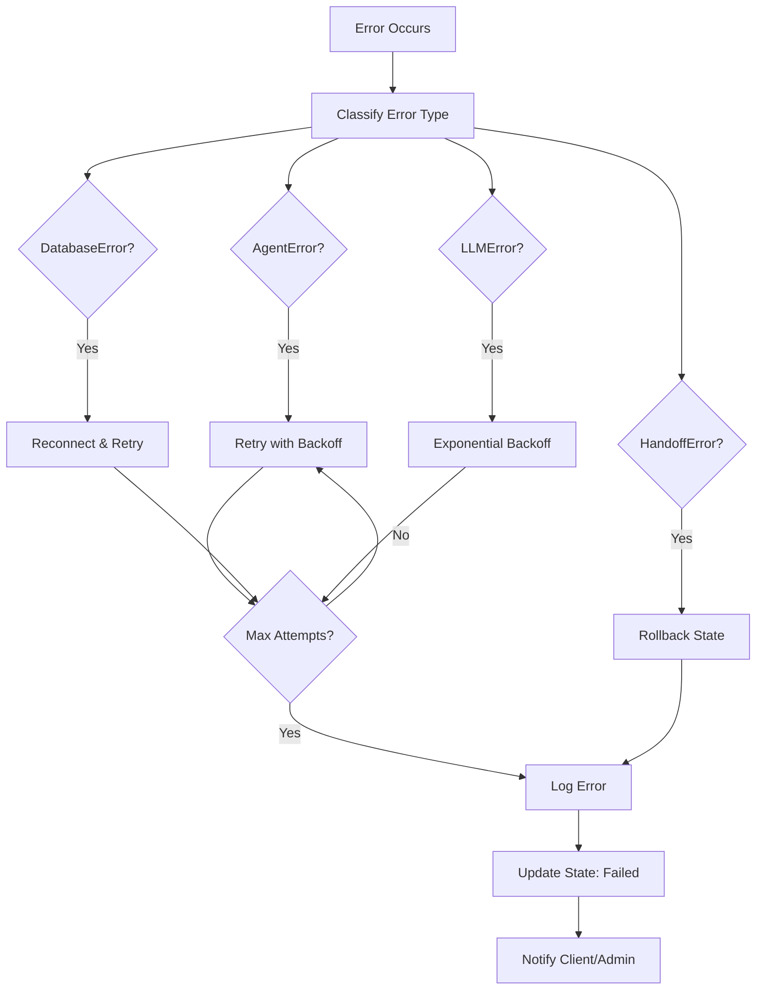

# Multi-Agent Insurance System - Low-Level Design (LLD)

## 1. Introduction

### 1.1 Purpose
This Low-Level Design (LLD) document provides detailed specifications for the Multi-Agent Insurance System. The system implements a collaborative architecture featuring specialized AI agents that work together to research and synthesize insurance policy information through orchestrated hand-off protocols.

### 1.2 Scope
This document covers:
- System architecture and component design
- Agent specifications and interactions
- Database schema and data models
- Workflow orchestration and sequence flows
- Error handling mechanisms
- Technology stack and configuration

### 1.3 System Overview
The system consists of two specialized agents:
- **Researcher Agent**: Sources policy coverage information from LLM and external APIs
- **Writer Agent**: Synthesizes and formats research data into structured outputs

These agents are coordinated by a Workflow Orchestrator that manages state, handles hand-offs, and ensures workflow completion.

## 2. System Architecture Diagram



## 3. Module Design

### 3.1 Workflow Orchestrator Module

**Purpose**: Manages agent lifecycle and coordinates hand-offs

**Responsibilities**:
- Initialize and manage workflow state
- Route tasks to appropriate agents
- Handle agent hand-off protocols
- Monitor workflow execution
- Error handling and retry logic

**Class Structure**:
```python
class WorkflowOrchestrator:
    - state_manager: StateManager
    - researcher_agent: ResearcherAgent
    - writer_agent: WriterAgent
    - workflow_state: dict
    - config: dict
    
    + execute_workflow(request: WorkflowRequest) -> WorkflowResult
    + handle_handoff(from_agent: str, to_agent: str, data: dict) -> bool
    + update_state(state_update: dict) -> None
    + handle_error(error: Exception) -> None
    + get_workflow_status(workflow_id: str) -> dict
```

### 3.2 State Manager Module

**Purpose**: Manages workflow state across agent hand-offs

**Responsibilities**:
- Store and retrieve workflow state
- Track agent transitions
- Maintain state consistency
- Provide state recovery mechanisms

**Class Structure**:
```python
class StateManager:
    - db_client: DatabaseClient
    - cache: CacheClient
    
    + create_state(workflow_id: str, initial_data: dict) -> State
    + update_state(workflow_id: str, updates: dict) -> bool
    + get_state(workflow_id: str) -> State
    + delete_state(workflow_id: str) -> bool
    + recover_state(workflow_id: str) -> State
    + lock_state(workflow_id: str) -> bool
    + unlock_state(workflow_id: str) -> bool
```

### 3.3 Database Client Module

**Purpose**: Abstract database operations for multiple database types

**Responsibilities**:
- Provide unified interface for database operations
- Handle connection management
- Support MongoDB, PostgreSQL, and ChromaDB

**Class Structure**:
```python
class DatabaseClient:
    - connection: Connection
    - db_type: str  # "mongodb", "postgresql", "chromadb"
    - connection_pool: ConnectionPool
    
    + connect() -> bool
    + disconnect() -> None
    + insert(collection: str, data: dict) -> str
    + query(collection: str, filter: dict) -> List[dict]
    + update(collection: str, id: str, data: dict) -> bool
    + delete(collection: str, id: str) -> bool
    + create_index(collection: str, fields: List[str]) -> bool
```

### 3.4 Hand-off Protocol Module

**Purpose**: Defines communication protocol between agents

**Responsibilities**:
- Validate hand-off data
- Transform data for target agent
- Ensure data integrity
- Track hand-off history

**Class Structure**:
```python
class HandoffProtocol:
    - validation_rules: dict
    - data_transformer: DataTransformer
    - handoff_history: List[dict]
    
    + validate_handoff(from_agent: str, data: dict) -> bool
    + transform_data(data: dict, target_agent: str) -> dict
    + create_handoff_payload(data: dict) -> HandoffPayload
    + verify_completion(agent: str, result: dict) -> bool
    + log_handoff(handoff_data: dict) -> None
```

### 3.5 API Gateway Module

**Purpose**: Expose RESTful API endpoints

**Responsibilities**:
- Handle HTTP requests
- Validate input
- Route to orchestrator
- Return responses

**Endpoints**:
```
POST /api/workflow/start
    Request: { "query": str, "parameters": dict }
    Response: { "workflow_id": str, "status": str }

GET /api/workflow/{workflow_id}/status
    Response: { "status": str, "current_agent": str, "progress": float }

GET /api/workflow/{workflow_id}/result
    Response: { "output": dict, "status": str }

DELETE /api/workflow/{workflow_id}
    Response: { "success": bool }
```

## 4. Agent Design

### 4.1 Researcher Agent

**Purpose**: Sources and gathers insurance policy information

**Key Responsibilities**:
- Query LLM for policy coverage information
- Use Crawl API for external data retrieval
- Validate and structure research findings
- Store intermediate results in database
- Signal completion for hand-off

**Class Structure**:
```python
class ResearcherAgent:
    - llm_client: OllamaClient
    - crawl_api: CrawlAPIClient
    - db_client: DatabaseClient
    - research_tools: List[Tool]
    - agent_config: dict
    
    + research_policy_coverage(query: str) -> ResearchResult
    + fetch_external_data(urls: List[str]) -> ExternalData
    + validate_findings(data: dict) -> bool
    + store_research_data(data: dict) -> str
    + prepare_handoff_data() -> HandoffData
    + execute_research_task(task: dict) -> dict
```

**Tools**:
- **Policy Coverage Search Tool**: Queries LLM for policy-specific information
- **Web Crawler Tool**: Fetches data from external sources via Crawl API
- **Data Validation Tool**: Validates and structures research findings

**Configuration**:
```python
RESEARCHER_AGENT_CONFIG = {
    "llm_model": "llama2",
    "temperature": 0.7,
    "max_tokens": 2000,
    "tools": ["policy_search", "web_crawler", "validator"],
    "max_retries": 3,
    "timeout": 30
}
```

### 4.2 Writer Agent

**Purpose**: Synthesizes and formats research data into structured output

**Key Responsibilities**:
- Retrieve research data from database
- Synthesize information using LLM
- Format output according to specifications
- Store final structured output
- Return formatted result

**Class Structure**:
```python
class WriterAgent:
    - llm_client: OllamaClient
    - db_client: DatabaseClient
    - formatter: OutputFormatter
    - synthesis_tools: List[Tool]
    - agent_config: dict
    
    + synthesize_data(research_id: str) -> SynthesizedData
    + format_output(data: SynthesizedData) -> FormattedOutput
    + store_final_output(output: dict) -> str
    + validate_output(output: dict) -> bool
    + execute_synthesis_task(task: dict) -> dict
```

**Tools**:
- **Data Synthesis Tool**: Combines and synthesizes research findings
- **Output Formatting Tool**: Formats output according to specifications
- **Quality Check Tool**: Validates output quality and completeness

**Configuration**:
```python
WRITER_AGENT_CONFIG = {
    "llm_model": "llama2",
    "temperature": 0.5,
    "max_tokens": 3000,
    "tools": ["synthesis", "formatting", "quality_check"],
    "max_retries": 3,
    "timeout": 45
}
```

### 4.3 Agent Communication Protocol

**Hand-off Payload Schema**:
```python
{
    "from_agent": str,
    "to_agent": str,
    "workflow_id": str,
    "data": {
        "research_id": str,
        "research_data": dict,
        "metadata": dict
    },
    "timestamp": datetime,
    "status": str
}
```

## 5. Sequence Flow

### 5.1 Complete Workflow Sequence



### 5.2 Error Handling Sequence



## 6. Database Design

### 6.1 Database Schema

#### 6.1.1 Workflow States Collection/Table

**MongoDB Collection / PostgreSQL Table**: `workflow_states`

```python
{
    "workflow_id": str,  # Primary Key / _id
    "status": str,  # "researching", "writing", "completed", "failed"
    "current_agent": str,
    "research_data": dict,
    "synthesis_data": dict,
    "metadata": {
        "query": str,
        "parameters": dict,
        "created_by": str
    },
    "error_log": List[dict],
    "created_at": datetime,
    "updated_at": datetime
}
```

**Indexes**:
- `workflow_id` (unique)
- `status`
- `created_at`

#### 6.1.2 Research Data Collection/Table

**MongoDB Collection / PostgreSQL Table**: `research_data`

```python
{
    "research_id": str,  # Primary Key / _id
    "workflow_id": str,  # Foreign Key
    "query": str,
    "policy_coverage_data": {
        "coverage_types": List[str],
        "limits": dict,
        "exclusions": List[str],
        "premium_info": dict
    },
    "external_data": [
        {
            "source": str,
            "url": str,
            "content": str,
            "extracted_at": datetime
        }
    ],
    "sources": List[str],
    "confidence_score": float,
    "created_at": datetime
}
```

**Indexes**:
- `research_id` (unique)
- `workflow_id`
- `created_at`

#### 6.1.3 Final Outputs Collection/Table

**MongoDB Collection / PostgreSQL Table**: `final_outputs`

```python
{
    "output_id": str,  # Primary Key / _id
    "workflow_id": str,  # Foreign Key
    "research_id": str,  # Foreign Key
    "synthesized_content": str,
    "formatted_output": {
        "summary": str,
        "detailed_coverage": dict,
        "recommendations": List[str],
        "metadata": dict
    },
    "quality_metrics": {
        "completeness": float,
        "accuracy": float,
        "readability": float
    },
    "created_at": datetime
}
```

**Indexes**:
- `output_id` (unique)
- `workflow_id`
- `research_id`
- `created_at`

### 6.2 Data Relationships

```
workflow_states (1) ----< (N) research_data
workflow_states (1) ----< (N) final_outputs
research_data (1) ----< (1) final_outputs
```

### 6.3 Database Selection Criteria

- **MongoDB**: Best for flexible schema, document storage, rapid prototyping
- **PostgreSQL**: Best for complex queries, ACID compliance, relational data
- **ChromaDB**: Best for vector embeddings, semantic search, similarity matching

## 7. Technology Stack

| Layer | Technology | Version/Purpose |
|-------|-----------|----------------|
| **Framework** | CrewAI | Agent orchestration and management |
| **Framework** | LangChain | LLM integration and tooling |
| **LLM** | Ollama | Local LLM inference |
| **Database** | MongoDB | Document storage (optional) |
| **Database** | PostgreSQL | Relational storage (optional) |
| **Database** | ChromaDB | Vector storage (optional) |
| **External API** | Crawl API | Web scraping and data extraction |
| **Language** | Python | 3.9+ |
| **API Framework** | FastAPI / Flask | REST API implementation |
| **State Management** | Custom State Manager | Workflow state persistence |
| **Caching** | Redis (optional) | State caching and performance |

### 7.1 Dependencies

```python
# Core Dependencies
crewai>=0.1.0
langchain>=0.1.0
langchain-community>=0.0.20
ollama>=0.1.0

# Database Drivers
pymongo>=4.6.0  # MongoDB
psycopg2-binary>=2.9.0  # PostgreSQL
chromadb>=0.4.0  # ChromaDB

# API Framework
fastapi>=0.104.0
uvicorn>=0.24.0

# Utilities
pydantic>=2.0.0
python-dotenv>=1.0.0
```

## 8. Error Handling Strategy

### 8.1 Error Types and Classification

| Error Type | Description | Severity | Recovery Strategy |
|------------|-------------|----------|-------------------|
| **AgentError** | Agent-specific failures (LLM timeout, tool error) | High | Retry with exponential backoff, max 3 attempts |
| **HandoffError** | Hand-off protocol failures (validation, data transformation) | Critical | Log error, rollback state, notify admin |
| **DatabaseError** | Database operation failures (connection, query) | High | Retry with connection pool, fallback to cache |
| **LLMError** | LLM API failures (rate limit, model error) | Medium | Exponential backoff, switch model if available |
| **ValidationError** | Data validation failures | Medium | Return error to client, log for review |
| **NetworkError** | External API failures (Crawl API timeout) | Medium | Retry with circuit breaker pattern |

### 8.2 Error Handling Flow



### 8.3 Retry Strategy

**Exponential Backoff Configuration**:
```python
RETRY_CONFIG = {
    "max_retries": 3,
    "initial_delay": 1,  # seconds
    "backoff_multiplier": 2,
    "max_delay": 60,  # seconds
    "jitter": True
}
```

**Circuit Breaker Pattern**:
```python
CIRCUIT_BREAKER_CONFIG = {
    "failure_threshold": 5,
    "timeout": 60,  # seconds
    "half_open_timeout": 30  # seconds
}
```

### 8.4 Error Logging

**Error Log Schema**:
```python
{
    "error_id": str,
    "workflow_id": str,
    "error_type": str,
    "error_message": str,
    "stack_trace": str,
    "context": dict,
    "timestamp": datetime,
    "resolved": bool
}
```

### 8.5 Recovery Mechanisms

1. **State Recovery**: Restore workflow state from last checkpoint
2. **Partial Results**: Return partial results if workflow partially completed
3. **Graceful Degradation**: Continue with available data if non-critical errors occur
4. **Manual Intervention**: Flag workflows requiring manual review

## 9. Future Improvements

### 9.1 Scalability Enhancements
- **Horizontal Scaling**: Deploy multiple agent instances with load balancing
- **Distributed State Management**: Use distributed cache (Redis Cluster) for state sharing
- **Message Queue**: Implement RabbitMQ/Kafka for asynchronous agent communication
- **Microservices Architecture**: Split agents into independent microservices

### 9.2 Performance Optimizations
- **Caching Layer**: Implement Redis for frequently accessed data
- **Parallel Processing**: Enable parallel research tasks for multiple queries
- **Database Optimization**: Add read replicas, connection pooling, query optimization
- **Async Operations**: Convert I/O-bound operations to async/await pattern

### 9.3 Feature Enhancements
- **Multi-Agent Collaboration**: Add more specialized agents (Validator, Quality Checker)
- **Real-time Updates**: WebSocket support for real-time workflow status updates
- **Agent Learning**: Implement feedback loop for agent performance improvement
- **Custom Output Formats**: Support multiple output formats (JSON, XML, PDF, Markdown)

### 9.4 Monitoring and Observability
- **Metrics Collection**: Prometheus/Grafana for system metrics
- **Distributed Tracing**: OpenTelemetry for request tracing across agents
- **Log Aggregation**: ELK stack for centralized logging
- **Alerting System**: Configure alerts for critical errors and performance degradation

### 9.5 Security Enhancements
- **Authentication/Authorization**: OAuth2, JWT tokens for API security
- **Data Encryption**: Encrypt sensitive data at rest and in transit
- **Rate Limiting**: Implement rate limiting per client/IP
- **Audit Logging**: Comprehensive audit trail for all operations

### 9.6 Testing and Quality Assurance
- **Unit Tests**: Comprehensive unit tests for all modules
- **Integration Tests**: End-to-end workflow testing
- **Load Testing**: Stress testing with high concurrent requests
- **Agent Evaluation**: Automated quality metrics for agent outputs

### 9.7 Data Management
- **Data Retention Policy**: Automated cleanup of old workflow data
- **Backup and Recovery**: Regular database backups and disaster recovery plan
- **Data Versioning**: Version control for research data and outputs
- **Data Analytics**: Analytics dashboard for workflow patterns and agent performance
